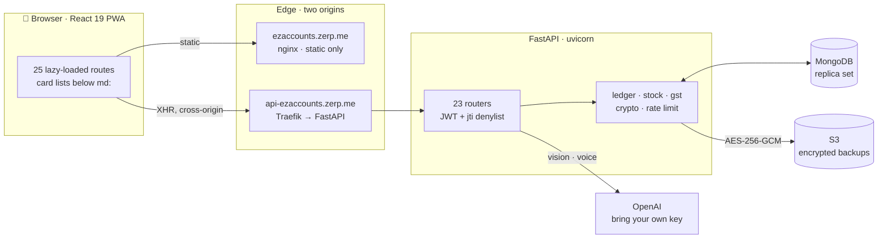
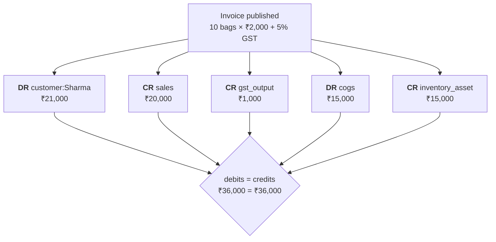
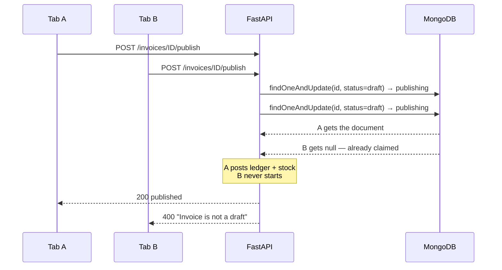

<div align="center">

# 📒 EZ Account

**Double-entry accounting for a small Indian wholesale business.**

Invoices · inventory · payments · GST · a ledger that has to add up every single time

[](https://github.com/kritish08/ez-account/actions/workflows/test.yml)


[ezaccounts.zerp.me](https://ezaccounts.zerp.me) · [api-ezaccounts.zerp.me](https://api-ezaccounts.zerp.me/api/health)

</div>

---

A wholesaler bills customers, buys stock, takes part-payments, files GST, and needs the books to be right at the end of the month. That is the product, and it is running.

What is worth reading is how it got here. EZ Account started as a generated scaffold in January 2026 — the first commits are still attributed to the generator — and it was good enough to run a real business on, while quietly getting the numbers wrong. Inventory showed **₹0 on every balance sheet** ever produced. Editing a product's name reset its cost to zero, so every later sale of it booked zero COGS. Double-clicking *Publish* credited the same revenue twice. None of it raised an error, because a wrong number in a ledger is still a number.

Most of the commits here are the work of finding those and deciding what to do about each one. If you want the short version, read the two diagrams below. If you want the long version, `git log`.

## Contents

- [What it does](#what-it-does)
- [Architecture](#architecture)
- [Where a rupee actually goes](#where-a-rupee-actually-goes)
- [The decision worth reading first](#the-decision-worth-reading-first)
- [Publishing an invoice twice](#publishing-an-invoice-twice)
- [Five more decisions](#five-more-decisions)
- [Measured, not asserted](#measured-not-asserted)
- [Repo structure](#repo-structure)
- [Quick start](#quick-start)
- [Environment](#environment)
- [Testing](#testing)
- [Security notes](#security-notes)
- [What's imperfect](#whats-imperfect)
- [Tech stack](#tech-stack)
- [Licence](#licence)

## What it does

- **Invoices** with a draft → publish lifecycle, automatic numbering, PDF export, and part-payment tracking that knows the difference between "paid" and "paid enough".
- **Inventory** valued from actual stock movements — purchases, sales, returns, production — rather than a number someone typed.
- **Payments** applied across invoices, advances and credit notes in one transaction, so a receipt can never land half-recorded.
- **GST** as an optional module, off by default. CGST/SGST for a local sale, IGST for out-of-state, decided by the place of supply, printed on a compliant tax invoice.
- **Reports** straight off the ledger: trial balance, balance sheet, P&L, outstanding, credit.
- **Scan a bill with your phone camera** and let a vision model fill the purchase form — bring your own OpenAI key, encrypted at rest.
- **Talk to it in Hinglish.** "₹5,000 ka invoice Sharma ji ko, cash mila" creates the invoice *and* books the cash.
- **Passkeys**, encrypted S3 backups on a schedule, and an installable phone app.

## Architecture



The UI container serves **static files only** — there is no `/api` proxy in it. The browser calls the API on its own hostname, which is why `CORS_ORIGINS` is mandatory and refuses to start empty, and why `ezaccounts.zerp.me/api/health` returns the SPA shell while `api-ezaccounts.zerp.me/api/health` returns `{"status":"ok"}`.

Mongo is a replica set, not a standalone, because recording a payment opens a real multi-document transaction. A single-node `mongod` rejects `start_transaction` outright — so local dev and CI both run `mongodb-atlas-local`, which is a one-member replica set, rather than a plain `mongo` image that would diverge from production.

## Where a rupee actually goes

Publishing one ₹21,000 GST invoice writes five rows, and they have to balance:



Tax is a liability, never revenue — money held on the government's behalf. Booking the gross to `sales` would overstate turnover by the tax on every invoice and leave the balance sheet with no record that it is owed onward.

## The decision worth reading first

**A purchase return credited the wrong account, and the trial balance still passed.**

A purchase debits `inventory_asset`. The return credited an account called `purchases_returns`. Debits equalled credits, so the trial balance tied, the balance sheet rendered, and every integrity check the system had came back green — while the ledger claimed stock that had physically gone back to the supplier. The overstatement compounded with every return.

That is the shape of the whole problem. The obvious guard in double-entry accounting is *do debits equal credits*, and it is the guard that cannot see this class of bug, because a wrong entry is still a balanced pair.

So the test that now guards the ledger walks a realistic trading day — buy, sell, collect cash, expense, sales return, purchase return, pay a supplier — and asserts balance at eight checkpoints:

```python
# backend/tests/test_financial.py
async def assert_balanced(step: str):
    body = (await http_client.get("/api/reports/trial-balance", ...)).json()
    assert body["is_balanced"] is True, (
        f"unbalanced after {step}: "
        f"debit {body['total_debit']} vs credit {body['total_credit']}"
    )
```

I checked it has teeth by injecting a one-sided entry; it failed and named the step. And it is worth being plain about what that buys: **this test would not have caught the bug that motivated it.** The purchase-return defect and a voice-created invoice that never recorded its cash both kept debits equal to credits. The assertions that actually catch them are the per-account ones alongside it — the invariant test is a floor, not a proof.

## Publishing an invoice twice

A slow connection, an impatient tap, two open tabs. The original code read the invoice, checked `status == "draft"`, then did three awaits of ledger and stock writes *before* flipping the status. Both requests passed the guard.



The check and the claim are now the same atomic operation ([`invoices.py:455`](backend/app/routers/invoices.py)). Because the ledger and stock writes that follow can still fail on their own, the handler unwinds both and returns the invoice to `draft` rather than leaving a half-published document behind. A test fires two simultaneous publishes and asserts the statuses are exactly `[200, 400]`.

## Five more decisions

**Money is a float, and exactly one function rounds it.** The textbook answer is `Decimal128`. The database already held thousands of float amounts written by the generated version, and converting them is a migration that has to be right first time on a system in daily use. So [`money.py:_money`](backend/app/services/money.py) rounds every per-line value to 2 dp at 28 call sites, and totals accumulate already-rounded values — the same result as `Decimal` at rupee magnitudes. The cost is that the guarantee is empirical rather than structural, and nothing in the type system enforces that `_money` was called. It exists because an invoice of many decimal-priced lines lands on `999.9999999…` and fails a `paid_amount >= total` check by a fraction of a paisa, so an invoice that *was* paid never marks itself paid.

**The admin gate deliberately fails open.** A user with no `role` field counts as an administrator ([`deps.py:83-96`](backend/app/deps.py)). Fail-closed is the correct default and I did not use it: nothing in the app had ever written a `role`, only the provisioning scripts had, so every live account was role-less and a fail-closed gate would have locked the owner out of his own backups on upgrade. An explicitly non-admin role *is* honoured, so the gate becomes real the moment a staff account exists — and a test pins that `role: "staff"` gets 403 on both restore and factory reset. Until then, it admits everyone, and the guarantee rests on a deployment fact rather than on code.

**Revocation needs a denylist *and* a version counter.** They answer different questions. A per-token `jti` denylist means "sign this device out" and leaves your other sessions alone. A per-user `token_version` means "sign everything out" after a lost phone. Neither can express the other. The counter is a counter rather than an "issued before time T" check because JWT `iat` has one-second resolution — a timestamp comparison either admits tokens minted in the same second as the revoke or rejects the user's own immediate re-login. A test found that. The denylist is bounded by a TTL index: a row only has to outlive the token it denies, so it deletes itself at exactly that moment ([`deps.py:50-72`](backend/app/deps.py)). The cost is that auth is no longer stateless — two reads on every request.

**The invariants that survive a bug live in the database.** Unique indexes on all five reference-number series and on `(product_id, serial_number)`, each with a `partialFilterExpression` limiting it to documents that have the field ([`server.py:150-176`](backend/server.py)). That filter is the whole trick: a plain unique index refuses to build on a collection whose older rows lack the field, so the usual outcome is that the index gets abandoned and the check stays in Python where it loses races. The constraint is forward-only — older documents do not participate — and the invariant that matters most, debits equal credits, cannot be expressed as an index at all.

**Two opposite failure policies, in one file.** When a work order fails part-way through consuming raw materials, the order is left `IN_PROGRESS` with no rollback. When it fails *after* the completion status flip, the status is rolled back so the user can retry ([`production.py:194`](backend/app/routers/production.py), [`:250`](backend/app/routers/production.py)). Rolling back a completion re-enables a retry that produces the same finished goods once. Rolling back a consumption re-enables a retry that consumes the same physical sacks twice, and a warehouse has no compensating transaction. The cost is a stranded order that needs a human to look at it.

## Measured, not asserted

| | Before | Now |
|---|---|---|
| `backend/server.py` | 5,639 lines | **278** — app factory, lifespan, 23 router includes |
| Initial JS (gzipped) | 351 kB, one bundle | **122,134 B**, route-split into 42 chunks |
| Barcode scanner (106 kB) | shipped on every page | loaded on first tap of *Scan* |
| Backend tests | 15 | **137** |
| Dashboard queries | `2N + M + K + 5` | ~9, independent of N |
| Source maps in production | served | none, enforced in CI |

The bundle numbers come from the built image and are re-measured by CI on every push, which fails the build over 140 kB. The query counts are read off the code. **The latency is not measured** — the "under 500 ms" figures in `FIXES.md` are acceptance criteria for a human to check, not recorded timings, and there is no benchmark in this repository.

## Repo structure

```text
ez-account/
├── backend/                FastAPI · one router per domain
│   ├── server.py             app factory, lifespan, 26 indexes (invariants live here)
│   ├── app/routers/          23 routers — invoices, payments, production, gst…
│   ├── app/services/         ledger, stock, money, gst, crypto, rate_limit, counters
│   ├── services/             AI: bill vision, voice handler, function executor
│   ├── tests/                20 files, 137 tests, throwaway DB per run
│   └── run_tests.sh          pytest inside the production image
├── frontend/                 React 19 + craco
│   ├── src/pages/            25 lazy-loaded routes
│   ├── src/components/       ResponsiveList (table ↔ cards), LazyBarcodeScanner
│   └── nginx.conf            static only — no /api proxy, by design
├── backup/                   standalone restore tool (reads the same envelope format)
├── docs/                     refactor plan, fragility audit, original PRD
├── FIXES.md                  1,380 lines — one entry per defect, with its failure mode
└── compose.yaml              production (Traefik labels, external network)
```

## Quick start

Four steps, in order. Each one has a distinct failure if you skip it.

```bash
# 1. compose.yaml attaches to an external network (Traefik, in production)
docker network create n8n-singh_default

# 2. Mongo as a replica set, on that network
docker run -d --name ezaccount-cluster --network n8n-singh_default \
  quay.io/mongodb/mongodb-atlas-local:latest

# 3. Backend config
cp .env.production.template backend/.env
```

Fill in at least these:

```ini
MONGO_URL=mongodb://ezaccount-cluster:27017/?directConnection=true
DB_NAME=ezaccount_local
JWT_SECRET=            # openssl rand -hex 32
MASTER_ENCRYPTION_KEY= # openssl rand -hex 32
CORS_ORIGINS=http://localhost:8080
```

Step 4 is `compose.override.yaml` in the repo root. It is gitignored because it is machine-specific, so a fresh clone has to write it — without it nothing is published to the host and the JS bundle is built against the production API:

```yaml
services:
  backend:
    environment:
      CORS_ORIGINS: "http://localhost:8080,http://localhost:3000"
    ports: ["8001:8001"]
  frontend:
    build:
      args:
        REACT_APP_BACKEND_URL: "http://localhost:8001"
    ports: ["8080:80"]
  backup:
    profiles: ["donotstart"]
```

Then:

```bash
docker compose up -d --build
curl http://localhost:8001/api/health     # {"status":"ok"}
```

UI on `http://localhost:8080`, API on `http://localhost:8001`.

> **Heads-up:** the API is a separate origin. `http://localhost:8080/api/health` returns the SPA shell, not JSON — the UI container has no `/api` proxy. That is the design, not a misconfiguration.

What each skipped step gives you:

| Skipped | What you see |
|---|---|
| The network | `network n8n-singh_default declared as external, but could not be found` |
| Mongo, or it is off that network | `Name or service not known` per index, then `dependency failed to start: container ez-backend is unhealthy` |
| `mongodb-atlas-local`, using plain `mongo` | Recording a payment fails — a standalone `mongod` rejects `start_transaction` |
| `CORS_ORIGINS` | The process refuses to boot, by design |

## Environment

| Variable | Required | Purpose |
|---|---|---|
| `MONGO_URL` | yes | Connection string; must be a replica set |
| `DB_NAME` | yes | Database name |
| `JWT_SECRET` | yes | Signs access tokens; the app refuses to start without it |
| `MASTER_ENCRYPTION_KEY` | yes | 64 hex chars. AES-256-GCM for backups and stored secrets |
| `CORS_ORIGINS` | yes | Explicit list. Unset **or** `*` is a boot failure |
| `OPENAI_API_KEY` | optional | Fallback only — the normal path is Settings → AI, encrypted at rest and swappable without a redeploy |
| `WEBAUTHN_RP_ID` | for passkeys | Must match the site's domain |
| S3 credentials | optional | Entered in Settings, never in env; encrypted before storage |

## Testing

```bash
cd backend && ./run_tests.sh -q          # 137 passed
```

Tests run inside the production image against your local replica set, with a throwaway database per run. CI runs three jobs on every push: the backend suite, a frontend build that fails if initial JS exceeds 140 kB gzipped or if source maps or the Tailwind CDN reappear, and a hygiene job that fails if credential-bearing files ever come back.

The suite reflects where things actually broke, not coverage for its own sake — a concurrent double-publish, a credit note applying before cash, a lockout that must also refuse the *correct* password, legacy plaintext secrets staying readable after encryption shipped, GST-off producing byte-identical output to pre-GST.

## Security notes

- **Restoring a backup** wipes every collection, so it takes four things: a session, an admin role, the account password re-entered, and the phrase `RESTORE AND OVERWRITE ALL DATA` typed exactly. Factory reset is gated the same way, plus a one-hour cooldown that a *failed* attempt also advances — so the phrase cannot be brute-forced by anyone holding a stolen token.
- **Secrets are encrypted at rest** with AES-256-GCM: envelope encryption with a per-payload key for backups, and a tagged `enc.v1:` form for config values. Untagged values are recognised as pre-encryption plaintext and passed through, because a migration that breaks every configured backup is not a security improvement.
- **API keys are never returned.** Settings shows whether a key exists, where it came from, and the last four characters.
- **Login throttling refuses the correct password too** while locked — otherwise the attacker who guesses right walks straight through it — and an unknown email throttles identically, so the 429 is not an account-enumeration oracle.
- **Passkeys** use `fido2`, with challenge state under a five-minute TTL index.
- Honest gaps are in the next section, including one that is not fixed.

## What's imperfect

Real, current, and mostly found by going looking.

- **Credentials leaked in git history are only half-dealt-with.** The history was rewritten to remove a MongoDB Atlas URI, an Azure key and five copies of a photographed customer bill. GitHub keeps pull-request refs on its own side, and I verified the old credential is **still fetchable** through `refs/pull/1/head` after the rewrite. Rotation is the only thing that actually closes it; a history rewrite is not.
- **No tenant isolation.** Records carry no owner field and queries are not scoped. Roles are not a substitute. Two businesses on one deployment would merge. Documented at the enforcement point, [`deps.py:11-17`](backend/app/deps.py).
- **`/api/uploads` is an unauthenticated static mount.** Bill scans are served to anyone with the URL; UUID filenames make them unguessable, not protected.
- **Stock is recomputed from the beginning of time.** `get_all_product_stock` runs a `$group` over the entire `stock_movements` collection with no `$match` and no rollup, and the product list, balance sheet, dashboard and production start all call it. First thing to fall over as history grows.
- **No pagination anywhere** — 52 `to_list(None)` calls in the routers and no `.limit()`. A business with 5,000 invoices sends all 5,000 to the browser.
- **The Mongo client has no timeouts.** An unreachable database means a 30-second hang per request instead of a fast failure, which is why the container reports "unhealthy" rather than "down".
- **The payment transaction has no retry and carries a stale guard.** It opens a transaction manually rather than through `with_transaction`, so a `TransientTransactionError` surfaces as a 500. The compare-and-swap re-read inside it predates the transaction and is close to unreachable now.
- **PDF rendering blocks the event loop** — `reportlab` runs synchronously in the handler, while `boto3` uploads are correctly moved off the loop with `asyncio.to_thread`. The same fix was applied in one place and not the other.
- **Conditional mediation is not implemented.** `isConditionalMediationAvailable` is referenced in the passkey support check but never awaited, and `credentials.get()` carries no `mediation` option — so there is no passkey autofill, and the reference makes the support check stricter than it needs to be.
- **The rate limiter is per-process.** One container today; two would double every limit. The module says so and names Redis as the trigger.
- **Thirteen of fifteen table pages are still desktop tables on a phone.** Invoices and Customers were converted to card lists as the pattern; the rest were not.
- **`bom.py` and `exports.py` have no tests, and there are no frontend tests at all.**
- **Create React App is end-of-life**, which is why `npm audit` reports build-time advisories with no fix path. Vite is the remedy and has not been done.

## Tech stack

| Layer | Choice |
|---|---|
| API | FastAPI, Motor (async Mongo), python-jose, bcrypt, fido2, cryptography |
| Frontend | React 19, React Router 7, Tailwind 3, shadcn/ui, craco |
| Data | MongoDB replica set — Atlas in production, `mongodb-atlas-local` in dev and CI |
| AI | OpenAI Responses API — vision for bill scanning, tool-calling for voice, key supplied per deployment in Settings |
| Documents | reportlab (invoice PDFs), qrcode (product labels) |
| Infra | Docker Compose, nginx, Traefik, GitHub Actions |
| Diagrams | Mermaid (this README) |

## Licence

No licence file is present, so default copyright applies and no permissions are granted. Ask if you would like to use it.

---

<div align="center">

*Debits on the left, credits on the right, and they agree.*

</div>
